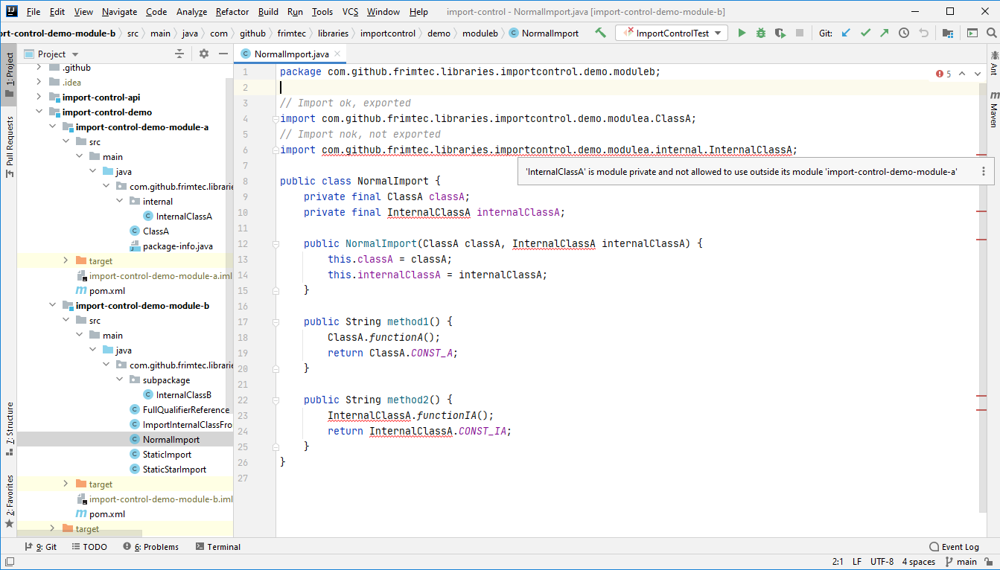
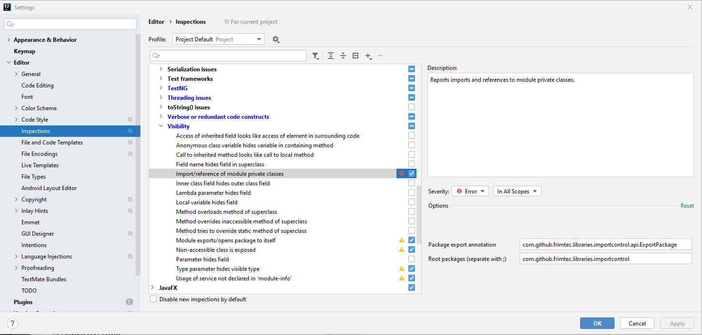

# IntelliJ-IDEA Import Control Plugin 
[](https://plugins.jetbrains.com/plugin/15308-import-control)


[](https://opensource.org/licenses/Apache-2.0)

[](https://github.com/frimtec/idea-import-control-plugin/actions?query=workflow%3ABuild)
[](https://github.com/frimtec/idea-import-control-plugin/actions?query=workflow%3A%22Deploy+release%22)


<!-- Plugin description -->
IntelliJ-IDEA inspection rule for Java [Import Control](https://github.com/frimtec/import-control/blob/main/README.md).

Reports all imports and references to module private classes ([Documentation](https://github.com/frimtec/idea-import-control-plugin/blob/main/README.md)).

Java previous to JDK 9 has a visibility concept that does not support modules very well.
If modules are splited into various packages, and only dedicated packages should be exported to other modules, the visibilty modifiers do not fit at all. All public classes can be imported to other modules.<br>
With JDK 9 JPMS was introduced to solve this issue. Using JPMS in a project is not an easy task and sometimes even not possible due to runtime restrictions.
This is where [Import Control](href="https://github.com/frimtec/import-control/blob/main/README.md") comes to rescue. It fully supports the need for import control between modules but with no runtime impact nor restrictions.
Packages of modules that shall be exported to other modules can be annotated with _@ExportPackage_ (or any other annotation of your choice). While editing in the IDE, imports to non exported classes from other modules are immediatly marked as errors.</p>

The ```@ExportPackage``` annotation is from the project [Import Control](https://github.com/frimtec/import-control) and is available on [maven central](https://search.maven.org/artifact/com.github.frimtec/import-control-api).
<!-- Plugin description end -->



## Installation

- Using IDE built-in plugin system:

  <kbd>Settings/Preferences</kbd> > <kbd>Plugins</kbd> > <kbd>Marketplace</kbd> > <kbd>Search for "import-control"</kbd> >
  <kbd>Install Plugin</kbd>

- Manually:

  Download the [latest release](https://github.com/frimtec/idea-import-control-plugin/releases/latest) and install it manually using
  <kbd>Settings/Preferences</kbd> > <kbd>Plugins</kbd> > <kbd>⚙</kbd> > <kbd>Install plugin from disk...</kbd>

## How to use
* Install the Plugin [Import Control](https://plugins.jetbrains.com/plugin/15308-import-control) from the Jetbrains Plugin-Repository.
* Configure the inspection rule ```Import/reference of module private classes``` (in group Java / Visibility).

## Configuration 

### Package export annotation
Defines the package annotation that flags the package as module export (default ```com.github.frimtec.libraries.importcontrol.api.ExportPackage```).

### Root packages
Defines root package (or several if separated by ';') of your multi-module project (only references to these root packages will be analysed). 
